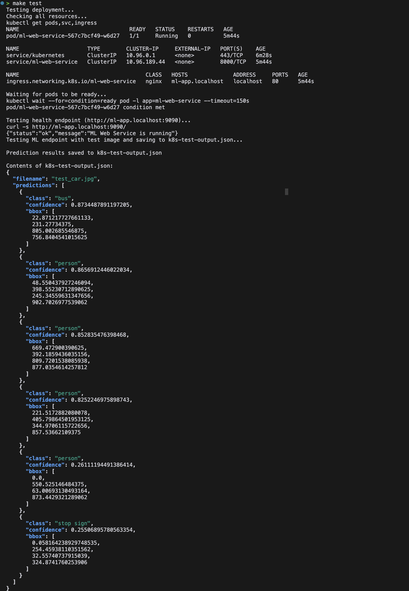

# 🤖 ML Tech Test

## 🎯 What is this?

A FastAPI application that uses YOLOv8 model to detect objects in images. The service can be run locally, in containers, or deployed to Kubernetes.

## 🛠️ Prerequisites

- Docker
- Kind (Kubernetes in Docker)
- Helm
- Python 3.9+

## 🚀 Quick Start

```bash
# Full automated setup with Kubernetes
make all-in-one

# Local development setup
python3 -m venv venv
source venv/bin/activate
## Install PyTorch CPU version
pip3 install --pre torch torchvision torchaudio --index-url https://download.pytorch.org/whl/nightly/cpu
pip3 install -r requirements.txt
python3 app/main.py

curl http://localhost:8000/
curl -X POST -F "file=@images/test_car.jpg" http://localhost:8000/detect
```

## 🔧 Available Make Commands

```bash
make setup     # Create Kind cluster and install nginx-ingress
make deploy    # Deploy application using Helm
make test      # Test the deployed application
make clean     # Remove deployment and cluster
make logs      # View application logs
make status    # Check deployment status
```

## 🐳 Container Setup

```bash
# Build and run locally
docker build -t ml-web-service .
docker run -p 8000:8000 ml-web-service

# Test the container
curl http://localhost:8000/
curl -X POST -F "file=@images/test_car.jpg" http://localhost:8000/detect
```

## ☸️ Manual Kubernetes Setup

```bash
# Create cluster and setup ingress
kind create cluster --config kind.yml
kubectl apply -f https://raw.githubusercontent.com/kubernetes/ingress-nginx/main/deploy/static/provider/kind/deploy.yaml

# Wait for ingress controller
kubectl wait --namespace ingress-nginx \
  --for=condition=ready pod \
  --selector=app.kubernetes.io/component=controller \
  --timeout=90s

# Deploy application
helm install ml-web-service chart/

# Test deployment
curl http://ml-app.localhost:9090/
curl -X POST -F "file=@images/test_car.jpg" http://ml-app.localhost:9090/detect

# Cleanup
helm uninstall ml-web-service
kind delete cluster
```

## 📝 API Endpoints

- `GET /` - Health check
- `POST /detect` - Object detection endpoint
  - Accepts: multipart/form-data with 'file' field
  - Returns: JSON with detected objects and confidence scores

## 🖼️ Example



## 📊 Sample Response

```json
{
  "filename": "test_car.jpg",
  "predictions": [
    {
      "class": "car",
      "confidence": 0.95,
      "bbox": [100, 200, 300, 400]
    }
  ]
}
```
