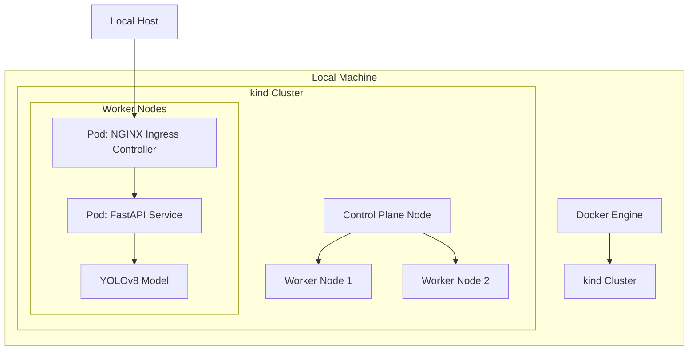
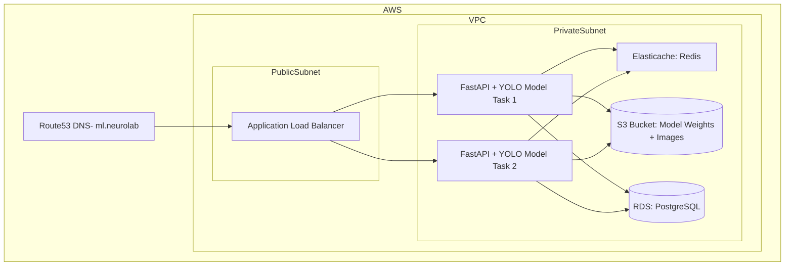

# Architectures

## Local in Kind

```mermaid
graph TD
    subgraph "Local Machine"
        A1[Docker Engine] --> A2[kind Cluster]
        subgraph "kind Cluster"
            B1[Control Plane Node] --> B2[Worker Node 1]
            B1 --> B3[Worker Node 2]
            subgraph "Worker Nodes"
                C1[Pod: FastAPI Service] --> C2[YOLOv8 Model]
                C3[Pod: NGINX Ingress Controller] --> C1
            end
        end
    end
    D[Local Host] --> C3


```

## Architecture on AWS

```mermaid
flowchart TB
    subgraph AWS
        Route53[Route53 DNS- ml.neurolab]
        
        subgraph VPC
            subgraph PublicSubnet
                ALB[Application Load Balancer]
            end

            subgraph PrivateSubnet
                ALB --> Task1[FastAPI + YOLO Model Task 1]
                ALB --> Task2[FastAPI + YOLO Model Task 2]
                Task1 --> Cache[Elasticache: Redis]
                Task2 --> Cache
                Task1 --> S3[(S3 Bucket: Model Weights + Images)]
                Task2 --> S3
                Task1 --> RDS[(RDS: PostgreSQL)]
                Task2 --> RDS
            end
        end
        Route53 --> ALB
    end

```
